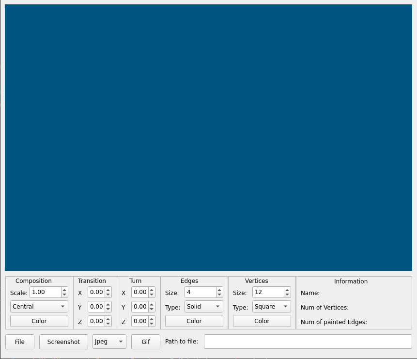

<!DOCTYPE html>
<html>

<body>
    <h1>Руководство 3DViewer</h1>
    <h2>Содержание</h2>
    <ol>
        <li><a name="1" href="#1-1">Установка</a></li>
        <li><a name="2" href="#2-2">Запуск</a></li>
        <li><a name="3" href="#3-3">Создание архива</a></li>
        <li><a name="4" href="#4-4">Описание 3DViewer</a></li>
        <li><a name="5" href="#5-5">Удаление</a></li>
    </ol>
    <h2>Установка</h2>
    
Чтобы установить вьювер перейдите в терминале в папку src и выполните команду:

    <pre>make install</pre>
    
Установленное приложение будет находиться в папке build под названием <b>3DViewer_v1</b>

    <h2>Запуска вьювера</h2>
    
Для использования/запуска вьювера перейдите в терминале в папку build и выполните команду:

    <pre>./3DViewer_v1</pre>
    <h2>Создание архива</h2>
    
Чтобы создать архив вьювера перейдите в терминале в папку src и выполните команду:

    <pre>make dist</pre>
    
В папке src появится файл <b>3DViewer.tar.gz</b>

    <h2>Описание 3DViewer</h2>
    <ul>
        <li>3DViewer
            
При запуске вьювера открывается главное окно - собственно вьювер:

            
            <ul>
                <li>Вьювер позволяет загружать 3D модели, вращать их, увеличивать/уменьшать, перемещать.</li>
                <li>На вход программы подается абсолютный путь до файла .obj, и затем нужно нажать кнопку "File".</li>
                <li>Представляется возможность менять цвет фона, ребер модели, вершин.</li>
                <li>Представляется возможность менять тип рёбер, тип вершин.</li>
                <li>Представляется возможность менять тип проекции.</li>
                <li>Представляется возможность сохранять скрин текущей модели.</li>
                <li>Представляется возможность сохранять гифку преобразований модели.</li>
            </ul>
        </li>
    </ul>
    <h2>Удаление</h2>
    
Чтобы удалить калькулятор перейдите в терминале в папку src и выполните команду:

    <pre>make uninstall</pre>
</body>

</html>